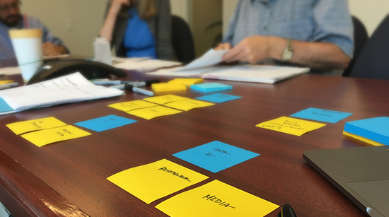
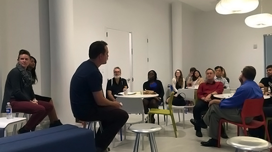
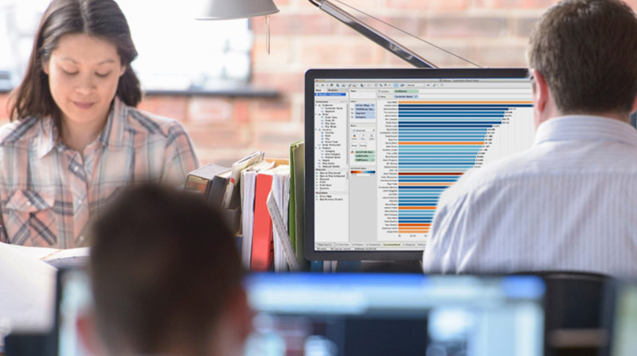

---
# You don't need to edit this file, it's empty on purpose.
# Edit theme's home layout instead if you wanna make some changes
# See: https://jekyllrb.com/docs/themes/#overriding-theme-defaults
layout: default
---
<section class="hero">
  

    

      

        <h1>
          XD is a government product studio. We build experimental data products
          for the public good.
        </h1>
        <a class="usa-button xd-btn" href="{{ site.baseurl }}">Learn More</a>
      

    

  

</section>
<section class="ctas">
  

    

      
      About Us
      <h2>
        We help agencies unlock the potential of their data.
      </h2>
      <a class="cta-link" href="{{ site.baseurl }}">Learn More</a>
    

    

      
      We’re Hiring
      <h2>
        Join our growing team at the intersection of data and impact.
      </h2>
      <a class="cta-link" href="{{ site.baseurl }}">Join Us</a>
    

    

      
      Case Study
      <h2>
        Building a better way to visualize government data.
      </h2>
      <a class="cta-link" href="{{ site.baseurl }}">Learn More</a>
    

  

</section>
